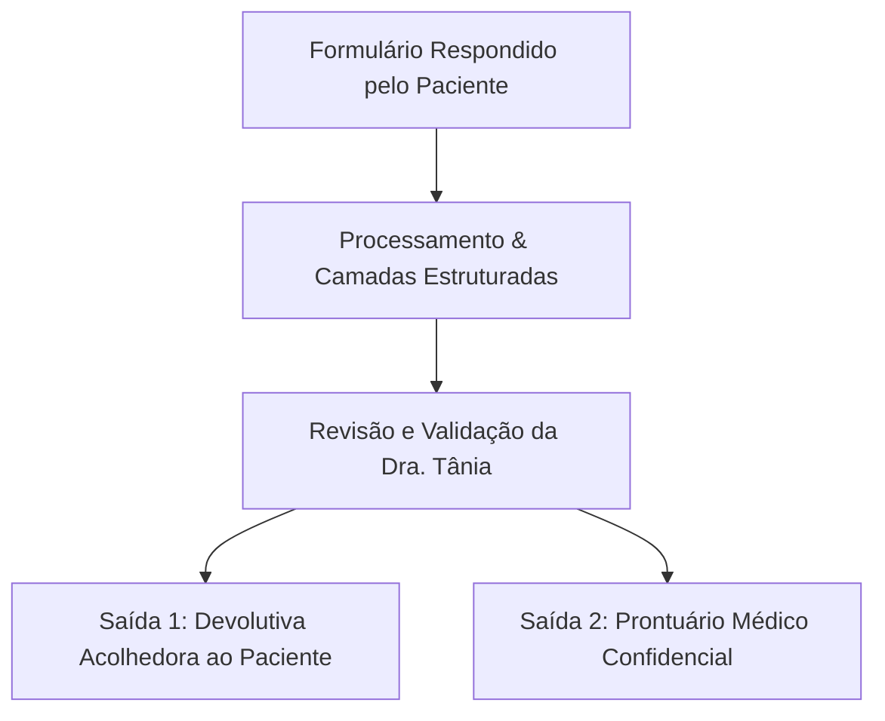

# FICHA INTEGRATIVA POR CAMADAS (V3.0)
### Pré-preenchimento Humanizado do Paciente • Validação Clínica • Especificação Técnica para IA & Desenvolvimento

---

> **Legenda de Acesso e Governança de Dados:**
> - `[PACIENTE - P]`: Campos exibidos na interface do paciente, com linguagem empática, desmedicalizada e acolhedora.
> - `[MÉDICA / CLÍNICO - C]`: Seção confidencial exclusiva da profissional (Dra. Tânia). Nunca exposta ao paciente sem validação direta.
> - `[REPETÍVEL 🔁]`: Entidades que geram registros independentes e dinâmicos (sintomas, condições, medicamentos, exames).

---

## 1. IDENTIFICAÇÃO E VISÃO DE FUTURO

```yaml
contexto: "Identificação humanizada, rotina e intenção terapêutica para 12 semanas"
ator: "[P]"
```

- **Como prefere ser chamado(a) (Nome social/afetivo):** `________________________`
- **Nome completo civil (para prontuário/receituário):** `________________________`
- **Data de nascimento:** `____/____/________`  |  **Idade:** `____ anos`  |  **Gênero/Identidade (se desejar compartilhar):** `________________________`
- **Profissão / Ocupação atual:** `________________________________________`
- **Como é a sua rotina diária hoje?** *(Ex: horários de trabalho, turnos, estudos, cuidados da casa/família)*
  `____________________________________________________________________________________`
- **Estado civil / Vida relacional:**
  - [ ] Solteiro(a)
  - [ ] Em um relacionamento / Namoro
  - [ ] Casado(a) / União estável
  - [ ] Separado(a) / Divorciado(a)
  - [ ] Viúvo(a)
  - [ ] Outro formato
  - [ ] Prefiro não informar
- **Tem filhos?** [ ] Não  [ ] Sim ➔ *Nomes e idades:* `____________________________`
- **Composição da família de origem:** *(Ex: mora com quem, posição entre irmãos - primogênito, caçula...)*
  `____________________________________________________________________________________`
- **Espiritualidade, fé ou filosofia de vida:** *(Opcional - O que lhe dá sentido ou amparo?)*
  `____________________________________________________________________________________`
- **O que fez você buscar essa consulta exatamente neste momento?**
  `____________________________________________________________________________________`
- **Em 12 semanas (cerca de 3 meses), o que você gostaria que estivesse diferente na sua vida e no seu bem-estar?**
  `____________________________________________________________________________________`

---

## 2. CAMADA BIOLÓGICA: SINAIS, RITMOS E SAÚDE FÍSICA

### 2.1. O que o seu corpo e sua mente têm sentido recentemente?
> *Selecione até **5 prioridades** que mais têm chamado a sua atenção:*

| Sinais Mais Comuns (Top 15) | Seleção | Sinais Mais Comuns (Top 15) | Seleção |
| :--- | :---: | :--- | :---: |
| 1. Preocupação constante ou mente que não desliga | [ ] | 9. Dificuldade para pegar no sono ou acordar no meio da noite | [ ] |
| 2. Sensação de aperto no peito, falta de ar ou palpitações | [ ] | 10. Acordar cansado(a), sem sentir que o sono recuperou | [ ] |
| 3. Desânimo, tristeza ou vontade de ficar quieto(a) | [ ] | 11. Cansaço físico constante ou falta de energia no dia | [ ] |
| 4. Perda de vontade ou prazer nas coisas que gostava | [ ] | 12. Dores no corpo (cabeça, costas, músculos ou articulações) | [ ] |
| 5. Irritação fácil ou pavio curto no cotidiano | [ ] | 13. Desconfortos na barriga (estufamento, azia, intestino preso/solto) | [ ] |
| 6. Mudanças no apetite (comer sem fome ou perder a vontade) | [ ] | 14. Sensação de cabeça aérea, esquecimentos ou lentidão | [ ] |
| 7. Dificuldade de focar ou concluir tarefas | [ ] | 15. Altos e baixos frequentes no humor no mesmo dia ou semana | [ ] |

- [ ] **Outro sinal importante que não está na lista:** `________________________________________`

---

#### 🔁 Detalhamento Estruturado dos Sintomas Prioritários
*(O sistema abre um cartão expansível para cada sintoma marcado acima)*

```
[ITEM DE SINTOMA 1]
• Nome do sintoma: [ Preenchido automaticamente da seleção ]
• Desde quando começou a perceber? [ Data aprox. ou há quanto tempo: ex: 3 meses, 2 anos ]
• Como ele acontece? [ ] Contínuo (todo dia)  [ ] Em crises/ondas  [ ] Episódios semanais
• O que costuma engatilhar ou piorar? [ Ex: estresse no trabalho, brigas, final do dia, privação de sono ]
• O que costuma ajudar ou aliviar? [ Ex: descansar, caminhar, respirar fundo, banho quente ]
• Grau de impacto nas suas atividades hoje (0 a 4):
  ( ) 0 - Não atrapalha  ( ) 1 - Incômodo leve  ( ) 2 - Atrapalha um pouco  ( ) 3 - Atrapalha muito  ( ) 4 - Incapacita temporariamente
```

---

### 2.2. Diagnósticos e Condições de Saúde Já Mencionados por Médicos

#### A. Saúde Emocional / Mental
**Algum médico ou psicólogo já diagnosticou ou comentou sobre algum quadro com você anteriormente?**
- [ ] Não, nunca recebi diagnóstico formal
- [ ] Não tenho certeza
- [ ] Sim, já me falaram sobre algo
- [ ] Prefiro conversar diretamente na consulta

*Se marcou "Sim", quais foram as condições explicadas a você? (Linguagem acolhedora, sem termos intimidadores):*
- [ ] Episódio de depressão ou tristeza profunda
- [ ] Ansiedade generalizada ou constante
- [ ] Crises de pânico ou sensação súbita de desespero
- [ ] Receio intenso de multidões, lugares fechados ou de sair de casa
- [ ] Oscilações marcantes de fases (períodos de muita agitação vs. fases de muita prostração)
- [ ] Dificuldade marcante de atenção, hiperatividade ou desatenção (TDAH)
- [ ] Pensamentos repetitivos que incomodam ou rituais para aliviar a aflição
- [ ] Marcas ou impactos persistentes após vivência de eventos difíceis/traumáticos
- [ ] Desafios com a alimentação (compulsão, restrição excessiva)
- [ ] Relação difícil ou dependência de álcool, tabaco ou outras substâncias
- [ ] Outro: `________________________`

---

#### B. Condições e Comorbidades de Saúde Física
**Você possui algum acompanhamento ou diagnóstico médico confirmado nas condições abaixo?**

| Mais Frequentes | Selecionar | Outras Condições Importantes | Selecionar |
| :--- | :---: | :--- | :---: |
| Pressão alta (Hipertensão) | [ ] | Dores de cabeça frequentes / Enxaqueca | [ ] |
| Diabetes ou Pré-diabetes | [ ] | Problemas intestinais (Colite, Síndrome do Intestino Irritável) | [ ] |
| Alteração na tireoide (Hipotireoidismo / Hashimoto) | [ ] | Gastrite crônica ou Refluxo | [ ] |
| Colesterol ou Triglicerídeos altos | [ ] | Doença autoimune ou inflamatória reumatológica | [ ] |
| Sobrepeso ou Obesidade | [ ] | Fibromialgia ou Dores crônicas pelo corpo | [ ] |
| Gordura no fígado (Esteatose hepática) | [ ] | Apneia do sono ou Ronco expressivo | [ ] |
| Ácido úrico elevado ou crises de gota | [ ] | Doença cardiovascular / Arritmia | [ ] |
| Nenhuma condição conhecida | [ ] | Outra condição de saúde: `________________` | [ ] |

---

#### 🔁 Detalhe da Condição Física Selecionada
*(Aberto dinamicamente para cada item assinalado)*
```
[CONDIÇÃO FÍSICA SELECIONADA: ex. Pressão Alta]
• Diagnosticada há quanto tempo? [ ____ anos / meses ]
• Quem acompanha atualmente? [ ] Clínico/Cardio  [ ] Posto de saúde  [ ] Sem acompanhamento no momento
• Tratamento atual: [ Medicamento, dieta, etc. ]
• Como considera que ela está hoje? [ ] Bem controlada  [ ] Parcialmente controlada  [ ] Descontrolada  [ ] Não sei avaliar
• Possui exames ou laudos recentes em mãos? [ ] Sim (posso anexar/levar)  [ ] Não
```

---

### 2.3. Experiência com Dor Física (Se houver)

- **Você tem sentido dor física com frequência?** [ ] Não  [ ] Sim, frequentemente  [ ] Às vezes

*Se Sim:*
- **Onde dói principalmente?** `________________________________________________`
- **Como é essa sensação?**
  - [ ] Pontada / Agulhada
  - [ ] Queimação / Ardência
  - [ ] Aperto / Pressão
  - [ ] Peso constante
  - [ ] Choque / Fisgada
  - [ ] Cansaço muscular profundo
  - [ ] Outro: `________________`
- **Escala de Intensidade Numérica (0 a 10):**
  `[ 0 - Sem Dor ]  1  2  3  4  5  6  7  8  9  [ 10 - Pior Dor Possível ]` ➔ **Sua nota média atual:** `[   ]`
- **Apoio Qualitativo e Emocional da Dor (Selecione a expressão que mais descreve o seu momento):**
  - 😊 **Nível 0:** *Sem dor, confortável e em paz.*
  - 😐 **Nível 2-3:** *Desconforto leve, consigo esquecer enquanto faço minhas tarefas.*
  - 🙁 **Nível 4-5:** *Dor moderada, me incomoda e me distrai, mas ainda consigo fazer coisas básicas.*
  - 😣 **Nível 6-7:** *Dor forte, limita meu trabalho, meu sono e minha paciência.*
  - 😭 **Nível 8-10:** *Dor intensa ou paralisante, não consigo me concentrar em nada além dela.*
- **O que faz piorar e o que ajuda a aliviar?** `____________________________________`
- **Como a dor afeta seu sono, trabalho e disposição?** `____________________________`

---

### 2.4. Medicamentos, Suplementos e Tratamentos

> **Instrução para a interface:** O usuário preenche em blocos horizontais organizados. Um botão *"＋ Adicionar outro medicamento"* adiciona uma nova linha/cartão estruturado.

#### A. Medicamentos e Suplementos em Uso Atual
*(Inclui prescrições, fitoterápicos, vitaminas e analgésicos frequentes)*

| Nome do Medicamento / Suplemento | Dose e Unidade (ex: 50mg, 10 gotas) | Como toma e horários (ex: 1x ao dia, pela manhã) | Para que você toma? (Motivo) | Desde quando toma? (Data ou tempo) | Está ajudando? | Teve algum efeito indesejado / incômodo? |
| :--- | :--- | :--- | :--- | :--- | :---: | :--- |
| `[ Digite o nome ]` | `[ Ex: 20mg ]` | `[ 1 cp à noite ]` | `[ Para dormir ]` | `[ Há 6 meses ]` | ( ) Sim<br>( ) Parcial<br>( ) Não<br>( ) Não sei | ( ) Não<br>( ) Sim ➔ *Qual:* `______________` |

*(Ação de UI: `[ + Adicionar outro medicamento atual ]`)*

---

#### B. Medicamentos que Você Já Usou no Passado e Parou
*(Especialmente remédios para ansiedade, sono, dor, humor, estômago ou emagrecimento)*

| Medicamento Anterior | Dose que tomava | Por quanto tempo usou? | Por qual motivo parou? | Teve reação adversa ou efeito ruim? |
| :--- | :--- | :--- | :--- | :--- |
| `[ Nome ]` | `[ Dose ]` | `[ Ex: 1 ano ]` | [ ] Não fez efeito suficiente<br>[ ] Orientação do médico<br>[ ] Efeito colateral ruim<br>[ ] Custo alto<br>[ ] Melhorei e recebi alta | [ ] Não<br>[ ] Sim ➔ *Descreva:* `___________________` |

*(Ação de UI: `[ + Adicionar outro medicamento anterior ]`)*

- **Alergias conhecidas a medicamentos ou substâncias:** `________________________________________`

---

### 2.5. Exames Laboratoriais e de Imagem Recentes

- **Você realizou exames de sangue ou imagem nos últimos 12 meses?**
  - [ ] Sim, tenho recentes
  - [ ] Fiz há mais de 1 ano
  - [ ] Não me lembro / Não fiz recentemente
- **Se tem exames recentes, quando foram feitos?** `Mês/Ano: ____/________`
- **Lembrou de alguma alteração importante que apareceu nos exames?** *(Ex: colesterol alto, glicose, anemia, vitamina D baixa, hormônio da tireoide alterado)*
  `____________________________________________________________________________________`
- *(Opção no App: `[ 📎 Anexar PDF ou foto do laudo dos exames ]`)*

---

### 2.6. Ritmos de Vida: Alimentação, Sono e Movimento

#### A. Padrão de Alimentação (Sem julgamentos morais)
- **Horários das refeições:**
  - [ ] Tenho horários razoavelmente regulares
  - [ ] Pulo refeições com frequência (ex: fico longos períodos sem comer)
  - [ ] Como em horários totalmente imprevisíveis
  - [ ] Costumo ter muita fome ou beliscar durante a madrugada
- **Rotina e praticidade:**
  - [ ] Costumo cozinhar e planejar minhas refeições
  - [ ] Como muito na correria / em frente a telas
  - [ ] Como fora de casa ou peço delivery com muita frequência
- **Relação com o apetite e emoções:**
  - [ ] Quando fico ansioso(a) ou estressado(a), busco comida para me acalmar
  - [ ] Quando estou sob estresse, perco totalmente a fome
  - [ ] Sinto que perco o controle sobre a quantidade que como
  - [ ] Sinto culpa ou arrependimento logo após comer
  - [ ] Consumo de água: [ ] Bebo bastante água (+2L)  [ ] Bebo pouca água ao longo do dia
- **Como funciona seu intestino?**
  - [ ] Regular (funciona quase todo dia, sem dor)
  - [ ] Preso / Lento (fico dias sem ir ao banheiro)
  - [ ] Solto / Fezes amolecidas frequentes
  - [ ] Alterna entre preso e solto
  - [ ] Costumo ter muitos gases, estufamento ou queimação após comer

---

#### B. Qualidade do Sono
- **Quantas horas você dorme em média por noite?** `Aprox. ____ horas`
- **Como você descreve suas noites:** *(Pode marcar mais de uma)*
  - [ ] Demoro muito para conseguir pegar no sono (mais de 30-40 min)
  - [ ] Acordo várias vezes no meio da noite e tenho dificuldade para voltar a dormir
  - [ ] Acordo muito cedo de manhã (antes do despertador) e não durmo mais
  - [ ] Meu sono é leve ou agitado; acordo com a sensação de não ter descansado
  - [ ] Já me falaram que eu ronco forte ou engasgo à noite (suspeita de apneia)
  - [ ] Tenho muita sonolência durante o dia que atrapalha o trabalho

---

#### C. Movimento e Corpo
- **Você pratica alguma atividade física hoje?**
  - [ ] Não faço no momento (rotina muito sedentária)
  - [ ] Caminho de forma leve / atividades cotidianas
  - [ ] Pratico atividade de 1 a 2 vezes por semana
  - [ ] Pratico atividade física com regularidade (3 ou mais vezes por semana)
- **Qual atividade e o que mais dificulta manter uma rotina?** *(Ex: falta de tempo, cansaço extremo, dores, desânimo)*
  `____________________________________________________________________________________`

---

## 3. CAMADA PSICOSSOCIAL: RELAÇÕES, HISTÓRIA E VIDA ATUAL

> *Aviso ao paciente: Esta seção é totalmente livre e respeitosa. Você só compartilha o que se sentir confortável hoje. Se preferir conversar pessoalmente, basta marcar essa opção.*

### 3.1. Momentos Difíceis na Infância ou Juventude *(Opcional)*
- **Durante o seu crescimento, você passou por situações especialmente marcantes ou difíceis?**
  - [ ] Tive uma infância estável e tranquila no geral
  - [ ] Perda ou ausência de uma figura de cuidado importante
  - [ ] Brigas, conflitos intensos ou instabilidade dentro de casa
  - [ ] Experiências difíceis na escola (bullying, exclusão ou preconceito)
  - [ ] Doença grave ou sofrimento marcante na família
  - [ ] Situações de violência física, verbal ou emocional
  - [ ] Outra situação que marcou minha história: `________________________`
  - [ ] *[ Prefiro conversar sobre isso apenas pessoalmente na consulta ]*
- **Quem era a pessoa que mais te dava acolhimento, segurança ou apoio nessa fase?**
  `____________________________________________________________________________________`

---

### 3.2. As Pressões e Apoios do Presente
- **O que mais tem pesado nos seus ombros hoje em dia?** *(Marque as principais)*
  - [ ] Cobrança, sobrecarga ou insatisfação no trabalho
  - [ ] Conflitos ou distanciamento na família
  - [ ] Conflitos ou incertezas no relacionamento amoroso
  - [ ] Cuidar de dependentes (pais idosos, filhos que demandam muito)
  - [ ] Preocupações financeiras ou materiais
  - [ ] Luto ou perda recente
  - [ ] Solidão ou sensação de não ter com quem desabafar
  - [ ] Uma mudança drástica de vida recente
  - [ ] Outros desafios ou preocupações: `________________________`
- **Quem são as pessoas com quem você realmente pode contar na vida quando precisa de ajuda?**
  `____________________________________________________________________________________`
- **O que você faz hoje que te devolve energia, alegria ou sensação de paz?** *(Hobbies, descanso, lazer)*
  `____________________________________________________________________________________`
- **Quais são as suas maiores qualidades ou forças internas que já te ajudaram a superar fases difíceis?**
  `____________________________________________________________________________________`

---

### 3.3. Como Você Percebe Suas Reações e Seu Estilo nas Relações
> *Aqui você encontrará afirmações sobre jeitos comuns de sentir e se relacionar. Nenhuma frase é um rótulo ou diagnóstico; são apenas pistas sobre o seu modo único de funcionar no mundo.*  
> **Escala:** `[ R = Raramente ]` • `[ A = Às vezes ]` • `[ F = Frequentemente ]` • `[ Conversar ]`

| Afirmação em Linguagem Amigável | R | A | F | Conversar |
| :--- | :---: | :---: | :---: | :---: |
| **01.** Fico atento(a) ou desconfiado(a) sobre as reais segundas intenções das pessoas comigo. | [ ] | [ ] | [ ] | [ ] |
| **02.** Sinto que funciono melhor sozinho(a) e costumo preferir manter distância e pouca intimidade. | [ ] | [ ] | [ ] | [ ] |
| **03.** Costumo sentir que meu jeito de pensar ou de ver o mundo é muito diferente da maioria. | [ ] | [ ] | [ ] | [ ] |
| **04.** Quando me sinto pressionado(a) ou frustrado(a), acabo agindo por impulso e me arrependo depois. | [ ] | [ ] | [ ] | [ ] |
| **05.** Meus sentimentos em relações próximas são muito intensos e sinto muito medo de ser abandonado(a) ou rejeitado(a). | [ ] | [ ] | [ ] | [ ] |
| **06.** Gosto e preciso me sentir visto(a), expressivo(a) e valorizado(a) pelas pessoas ao redor. | [ ] | [ ] | [ ] | [ ] |
| **07.** Sinto muita mágoa ou irritação quando não reconhecem meu valor, esforço ou dedicação. | [ ] | [ ] | [ ] | [ ] |
| **08.** Muitas vezes deixo de me aproximar de pessoas ou grupos por receio de ser julgado(a) ou passar vergonha. | [ ] | [ ] | [ ] | [ ] |
| **09.** Acho muito difícil tomar decisões importantes sem o apoio, validação ou segurança de alguém próximo. | [ ] | [ ] | [ ] | [ ] |
| **10.** Me cobro um padrão de perfeição muito alto em tudo o que faço e fico incomodado(a) com bagunça ou erros. | [ ] | [ ] | [ ] | [ ] |

---

## 4. FORMULAÇÃO CLÍNICA E VALIDAÇÃO MÉDICA `[EXCLUSIVO C]`
*(Área confidencial: preenchida e revisada exclusivamente pela Dra. Tânia)*

```yaml
modulo: "Área Clínica Especializada Dra. Tânia"
seguranca: "Dados não publicados automaticamente ao paciente"
```

### 4.1. Mapeamento Clínico dos Padrões Relacionais (Clusters de Personalidade)
> *As respostas do item 3.3 são correlacionadas heuristicamente pela médica com os agrupamentos do DSM-5-TR / CID-11:*
- **Frases 01 a 03 (Espectro Excêntrico/Distante - Cluster A):**
  - Avaliação de hipervigilância, isolamento protetor, afeto embotado ou pensamento mágico.
  - *Notas da profissional:* `________________________________________________________`
- **Frases 04 a 07 (Espectro Dramático/Emocional/Instável - Cluster B):**
  - Avaliação de impulsividade, desregulação afetiva (limítrofe), busca de validação externa ou traços narcísicos.
  - *Notas da profissional:* `________________________________________________________`
- **Frases 08 a 10 (Espectro Ansioso/Inseguro/Controlador - Cluster C):**
  - Avaliação de evitação fóbica, dependência instrumental/emocional ou rigidez perfectionista (anancástica/TOCP).
  - *Notas da profissional:* `________________________________________________________`

---

### 4.2. Avaliação dos 18 Esquemas Desadaptativos Iniciais (Young)
> *Preenchido pela profissional com base na entrevista clínica ou no Inventário de Esquemas (YSQ):*

```
[Domínio I: Desconexão e Rejeição]
[ ] Privação Emocional   [ ] Abandono / Instabilidade   [ ] Desconfiança / Abuso
[ ] Isolamento Social    [ ] Defectividade / Vergonha

[Domínio II: Autonomia e Desempenho Prejudicados]
[ ] Fracasso             [ ] Dependência / Incompetência
[ ] Vulnerabilidade ao Dano / Doença   [ ] Emaranhamento / Self Subdesenvolvido

[Domínio III: Limites Prejudicados]
[ ] Merecimento / Grandiosidade        [ ] Autocontrole / Autodisciplina Insuficientes

[Domínio IV: Orientação para o Outro]
[ ] Subjugação           [ ] Autossacrifício            [ ] Busca de Aprovação / Reconhecimento

[Domínio V: Supervigilância e Inibição]
[ ] Negativismo / Pessimismo           [ ] Inibição Emocional
[ ] Padrões Inflexíveis / Postura Crítica               [ ] Postura Punitiva
```
- **Esquemas Nucleares Ativados e Gatilhos Identificados:**
  `____________________________________________________________________________________`

---

### 4.3. Raciocínio Clínico e Hipóteses Diagnósticas Médicas
- **Sinais Vitais e Exame Físico / Avaliação Geral:**
  - PA: `____/____ mmHg` | FC: `____ bpm` | Peso/IMC: `____ kg (IMC: ____)` | Circ. Abd: `____ cm`
  - Observações gerais: `________________________________________________________`
- **Exames Laboratoriais Analisados e Pendências:**
  `____________________________________________________________________________________`
- **Hipóteses Diagnósticas Principais e Comorbidades (com CID-11 / DSM-5-TR):**
  1. `________________________________________` [ ] Ativa / Confirmada  [ ] Em investigação
  2. `________________________________________` [ ] Ativa / Confirmada  [ ] Em investigação
  3. `________________________________________` [ ] Ativa / Confirmada  [ ] Em investigação
- **Segurança Clínica e Red Flags:**
  - Risco de autoagressão / ideação: [ ] Ausente  [ ] Passiva/Sem plano  [ ] Alerta ativo
  - Sintomas psicóticos / mania / bipolaridade: [ ] Não relatados  [ ] Investigar
  - Dependência grave de substâncias: [ ] Não  [ ] Sim ➔ `____________________`
- **Conduta Médica Inicial e Estratégia Terapêutica:**
  - Prescrição / Ajuste farmacológico: `________________________________________`
  - Desprescrição planejada / Redução de polifarmácia: `________________________`
  - Exames complementares solicitados: `________________________________________`
  - Encaminhamentos interdisciplinares (Psicoterapia, Nutrição, Fisioterapia): `____`

---

## 5. SAÍDAS E RESULTANTES (DUPLA VISÃO)



### Saída 1: Devolutiva Humanizada para o Paciente
*(Documento em PDF/Card no app com linguagem clara e encorajadora entregue após a consulta)*
- **Resumo do que você nos contou:** Suas principais queixas e os motivos da busca pelo cuidado.
- **Seu corpo e seus ritmos biológicos:** Como seu sono, alimentação e corpo estão conversando com suas emoções hoje.
- **Seus padrões e forças protetoras:** Reconhecimento dos seus recursos internos e áreas de vida que trazem paz.
- **Nossas 3 Metas Compartilhadas para as Próximas 12 Semanas:**
  1. *Meta 1 (Ritmo/Corpo):* `[ Ação prática, com prazo e indicador simples ]`
  2. *Meta 2 (Emocional/Psicossocial):* `[ Ação prática, com prazo e indicador simples ]`
  3. *Meta 3 (Autocuidado/Rotina):* `[ Ação prática, com prazo e indicador simples ]`
- **Data do próximo reencontro:** `____/____/________`

---

### Saída 2: Relatório Clínico Confidencial (Prontuário Médico)
*(Estrutura pronta para integração com prontuário eletrônico / EMR)*
- **Dados Demográficos e Linha do Tempo:** Idade, histórico familiar, fatores de risco cardiovascular e metabólico.
- **Perfil Farmacológico Consolidado:** Medicamentos vigentes, falhas prévias, reações adversas e interações medicamentosas.
- **Formulação Diagnóstica por Camadas:** Hipóteses médicas (CID-11), comorbidades físicas, esquemas de Young mapeados e perfil de estressores.
- **Plano de Tratamento e Metas Clínicas:** Indicadores de resposta terapêutica, datas de revisão de dosagem e exames de controle.

---

## 6. GUIA TÉCNICO DE IMPLEMENTAÇÃO (FRONT-END & ARQUITETURA IA)

### 6.1. Experiência de Usuário (UX/UI): "Card Stepper Progressivo"
Para garantir que o formulário transmita a sofisticação e o acolhimento de um consultório de alto padrão (high-ticket), a interface deve seguir rigorosamente a seguinte paleta de cores e regras de front-end:

#### Paleta de Cores e Tokens de Design (Identidade High-Ticket Dra. Tânia)
| Elemento de UI | Cor Aplicada | Código Hex | Papel na Experiência |
| :--- | :--- | :---: | :--- |
| **Fundo principal** | Off-white | `#F7F5F1` | Conforto óptico, sofisticação e serenidade |
| **Títulos e Perguntas** | Azul profundo | `#0F2233` | Legibilidade nobre, autoridade institucional |
| **Texto de leitura/respostas**| Cinza escuro | `#374151` | Contraste ergonômico sem cansar a visão |
| **Superfícies de cartões/campos**| Branco puro | `#FFFFFF` | Destaque e respiro para inputs e tabelas |
| **Bordas e divisórias sutis** | Cinza claro | `#D9DEE3` | Delimitação minimalista e moderna |
| **Opção selecionada / Botões**| Azul profundo + Branco | `#0F2233` + `#FFFFFF` | Feedback claro de seleção com máximo contraste |
| **Acentos, ícones e progresso**| Dourado fosco | `#B49B67` | Toque de requinte, indicador de etapa e medalhas |

1. **Identidade Visual Integrada:**
   - Ambas as camadas (Biológica e Psicossocial) operam sob a mesma paleta e tipografia nobre (serif clássica como Cormorant Garamond / Georgia nos cabeçalhos e sans-serif limpa como Plus Jakarta Sans / Inter no corpo). A diferenciação das camadas ocorre por títulos claros e ícones discretos com acabamento em dourado fosco (`#B49B67`).
2. **Princípio do "Pergunta Fixa, Opções que se Recolhem":**
   - No topo do cartão de visualização, a pergunta atual permanece fixada.
   - Quando o paciente seleciona uma resposta em itens de escolha única, as outras opções se recolhem suavemente (animação de collapse em ~250ms), a opção escolhida ganha destaque visual acolhedor (pílula em Azul Profundo `#0F2233` com texto branco), e o próximo campo ou pergunta expande abaixo no mesmo container.
3. **Seleções Múltiplas com "Continuar":**
   - Perguntas de múltipla escolha (ex: Top 15 sintomas ou comorbidades físicas) **não avançam automaticamente** ao toque. O usuário marca livremente as opções e toca no botão nobre **`Continuar`** para avançar.
4. **Cartões Repetíveis e Compactos em Linha (Medicamentos e Exames):**
   - Os medicamentos devem ser apresentados em cartões horizontais organizados, evitando rolagem infinita confusa.
   - Campos de dose e unidade separados: `input[type=number]` para o valor e `select` para a unidade (mg, g, ml, gotas, mcg, cp).
   - O botão com contorno dourado `[ ＋ Adicionar outro medicamento ]` cria um novo cartão com campos limpos, mantendo o anterior condensado em modo resumo (ex: *"Sertralina 50mg • 1x pela manhã • Há 6 meses"* com botão editar/excluir).
5. **Escala de Dor Visual e Qualitativa:**
   - Slider contínuo de 0 a 10 sincronizado com os 5 avatares/carinhas qualitativas interativas. Tocar na carinha ajusta a faixa do slider e vice-versa.
6. **Autossalvamento e Respeito ao Ritmo:**
   - Estado salvo a cada transição de campo no `localStorage` / backend (`status: "draft"`).
   - Botão discreto *"Salvar e continuar depois"* disponível em todas as etapas.

---

### 6.2. Estrutura de Dados Estruturada (Schema JSON para Backend e IA)

```json
{
  "ficha_integrativa": {
    "versao": "3.0",
    "metadados": {
      "paciente_id": "uuid-paciente",
      "data_inicio": "2026-10-01T11:00:00Z",
      "status": "rascunho_paciente",
      "ultima_atualizacao": "2026-10-01T11:25:00Z"
    },
    "identificacao": {
      "nome_preferido": "string",
      "nome_civil": "string",
      "data_nascimento": "YYYY-MM-DD",
      "idade": 0,
      "genero_identidade": "string",
      "ocupacao": "string",
      "rotina_resumo": "string",
      "estado_relacional": "string",
      "filhos": { "tem": false, "descricao": "string" },
      "familia_origem": "string",
      "espiritualidade": "string",
      "motivo_busca": "string",
      "objetivo_12_semanas": "string"
    },
    "camada_biologica": {
      "sintomas_selecionados": [
        {
          "id_sintoma": "preocupacao_constante",
          "inicio": "string",
          "padrao": "continuo | crises | semanal",
          "gatilhos": "string",
          "fatores_alivio": "string",
          "impacto_0_a_4": 3
        }
      ],
      "sintoma_outro": "string",
      "diagnosticos_emocionais_relatados": [
        {
          "categoria": "ansiedade_persistente",
          "profissional_informou": "string",
          "quando_informou": "string"
        }
      ],
      "comorbidades_fisicas": [
        {
          "condicao": "hipertensao",
          "tempo_diagnostico": "string",
          "acompanhamento": "string",
          "tratamento": "string",
          "status_controle": "bem_controlada | parcial | descontrolada | nao_sei",
          "tem_laudos": true
        }
      ],
      "dor": {
        "presente": true,
        "localizacao": "string",
        "tipo_sensacao": ["pontada", "peso"],
        "intensidade_numerica": 6,
        "expressao_qualitativa_nivel": 3,
        "fatores_piora_alivio": "string",
        "impacto_funcional": "string"
      },
      "farmacoterapia_atual": [
        {
          "medicamento": "string",
          "dose_valor": 50,
          "dose_unidade": "mg",
          "posologia": "1x ao dia pela manha",
          "motivo": "string",
          "tempo_uso": "string",
          "beneficio_percebido": "sim | parcial | nao | nao_sei",
          "reacao_adversa": {
            "houve": true,
            "descricao": "string"
          }
        }
      ],
      "farmacoterapia_previa": [
        {
          "medicamento": "string",
          "dose": "string",
          "tempo_uso": "string",
          "motivo_suspensao": "efeito_adverso | ineficacia | orientacao_medica | custo | outro",
          "detalhes_reacao": "string"
        }
      ],
      "alergias_medicamentosas": "string",
      "exames_recentes": {
        "realizados_ultimos_12m": true,
        "data_aproximada": "YYYY-MM",
        "alteracoes_relatadas": "string",
        "arquivos_anexos": ["url1", "url2"]
      },
      "ritmos": {
        "alimentacao": {
          "regularidade": "regulares | pula_refeicoes | variaveis | madrugada",
          "praticidade": ["come_na_correria", "delivery_frequente"],
          "relacao_emocional": ["come_sob_estresse", "culpa_ao_comer"],
          "consumo_agua": "baixo | adequado",
          "habito_intestinal": "regular | constipado | diarreico | alternante",
          "sintomas_digestivos": "string"
        },
        "sono": {
          "horas_medias": 6.5,
          "padroes": ["dificuldade_adormecer", "sono_nao_reparador"],
          "sonolencia_diurna": true
        },
        "atividade_fisica": {
          "nivel": "sedentario | leve | 1_2_semana | regular_3_mais",
          "tipo": "string",
          "barreiras": "string"
        }
      }
    },
    "camada_psicossocial": {
      "infancia_juventude": {
        "eventos_marcantes": ["conflitos_casa", "bullying"],
        "prefere_conversar_pessoalmente": false,
        "figura_seguranca": "string"
      },
      "estressores_atuais": ["sobrecarga_trabalho", "financeiro"],
      "rede_apoio": "string",
      "fontes_prazer_energia": "string",
      "forcas_pessoais": "string",
      "estilos_relacionais_respostas": {
        "item_01_hipervigilancia": "A",
        "item_02_distancia": "R",
        "item_03_incompreensao": "A",
        "item_04_impulsividade": "F",
        "item_05_instabilidade_afeto": "F",
        "item_06_expressividade": "A",
        "item_07_hipersensibilidade_reconhecimento": "F",
        "item_08_evitacao_julgamento": "R",
        "item_09_dependencia_validacao": "A",
        "item_10_perfeccionismo": "F"
      }
    },
    "area_clinica_medica": {
      "revisao_efetuada": false,
      "sinais_vitais": { "pa": "string", "fc": 0, "peso": 0, "imc": 0 },
      "clusters_relacionais_interpretacao": "string",
      "esquemas_desadaptativos_ativados": ["abandono", "padroes_inflexiveis"],
      "hipoteses_diagnosticas_cid11": [],
      "seguranca_red_flags": { "risco_suicida": "ausente", "alertas": "string" },
      "conduta_medica": "string",
      "metas_12_semanas": [
        { "area": "corpo", "meta": "string", "prazo": "string" },
        { "area": "emocional", "meta": "string", "prazo": "string" },
        { "area": "autocuidado", "meta": "string", "prazo": "string" }
      ]
    }
  }
}
```
